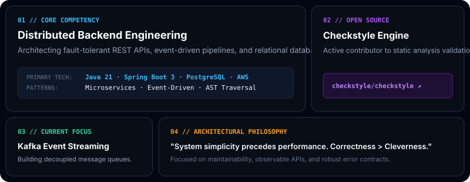
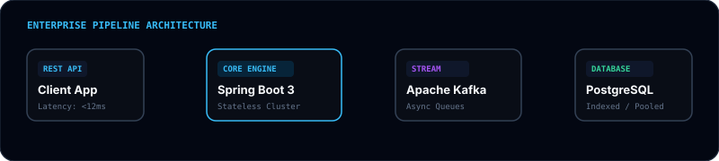
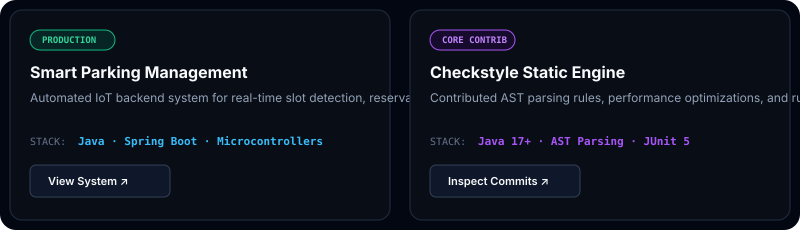

<!-- SAAS LANDING HERO BANNER -->

  <picture>
    <source media="(prefers-color-scheme: dark)" srcset="hero-saas.svg">
    <source media="(prefers-color-scheme: light)" srcset="hero-saas.svg">
    
  </picture>

<!-- DYNAMIC TYPING HEADLINE -->

  

 

<!-- LINEAR-STYLE BENTO GRID -->

  

 

<!-- ENTERPRISE ARCHITECTURE MAP -->

  

 

<!-- FEATURED CASE STUDIES -->

  

 

<!-- TECH STACK MATRIX -->
<h3 align="center">🛠️ Technology Ecosystem</h3>

  

 

<!-- REAL-TIME CONTRIBUTION GRAPH -->
<h3 align="center">📊 Activity Telemetry</h3>

  <picture>
    <source media="(prefers-color-scheme: dark)" srcset="https://raw.githubusercontent.com/abhishek-bansode/abhishek-bansode/output/github-snake-dark.svg">
    <source media="(prefers-color-scheme: light)" srcset="https://raw.githubusercontent.com/abhishek-bansode/abhishek-bansode/output/github-snake.svg">
    
  </picture>

 

---

<!-- SAAS-STYLE FOOTER -->
<table width="100%">
  <tr>
    <td align="left">
      <b>ABHISHEK BANSODE</b> 
      Backend Engineer · Software Developer
    </td>
    <td align="center">
      <code>🟢 OPEN FOR OPPORTUNITIES</code>
    </td>
    <td align="right">
      <a href="https://abhishek-bansode.netlify.app/"><b>Portfolio Site ↗</b></a> &nbsp;|&nbsp;
      <a href="https://github.com/abhishek-bansode"><b>GitHub Profile</b></a>
    </td>
  </tr>
</table>

  Designed with ⚡ inspiration from Vercel &amp; Linear web platforms

